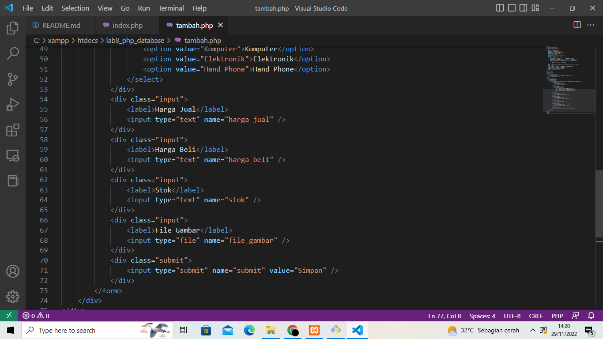

# Lab8Web

# TUGAS 8

| Nama | kelas | Nim | Matkul |
| -- | --- | ---- | ----------- |
| Heri Anto Simamora | TI.21.B.2| 312110365 | Perograman Web |

## MEMBUAT DATABASE,MEMBUAT TABEL DAN MENAMBAHKAN DATA

## MEMBUAT FILE KONEKSI DATABASE 

## MEMBUAT FILE INDEX UNTUK MENAMPILKAN DATA (READ)

## MENAMBAH DATA (CREATE)

## MENGUBAH DATA (UPDATE)

## MENGHAPUS DATA (DELETE)

